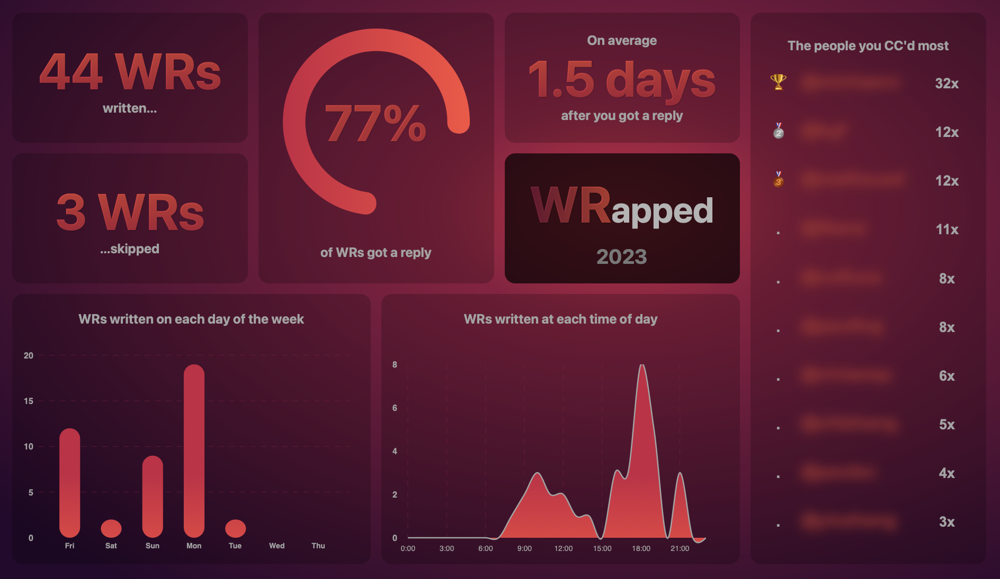

# WRapped

<div align="center">

  

</div>

## Description

This project is inspired by the yearly 'Spotify Wrapped', which is a summary of your listening habits over the past year. Wrapped does the same thing, but for Weekly reports a.k.a. WRs written by E-Mails. It is a simple script that parses your E-Mail inbox and outbox and generates statistics about your weekly reports. The statistic extraction is written in Rust, which creates a JSON file that is visualized using a web app.

## Getting Started

1. Install [Rust](https://rustup.rs), if you don't have already

2. Clone this repository and navigate into it:
    ```bash
    git clone https://github.com/fischeti/WRapped.git
    cd WRapped
    ```
3. Modify the mail configuration `config.toml` as explained in the [Configuration](#configuration) section:

4. Run the app to generate the statistics:
    ```bash
    cargo run
    ```
    which should automatically open a browser window with the statistics.

## Configuration

The configuration file is written in [TOML](https://toml.io). To login to your E-Mail account, you need to provide the following information:

```toml
[server]
# The IMAP server to connect to (you can find this information in your E-Mail client)
server = "my.mail.server"
# The port to connect to
port = 993
```
The configure which E-Mails to search for and fetch, you need to provide the following information:

```toml
[server]
# The mailboxes to fetch from the WRs you sent,
# you can also run `cargo run mailboxes` to get a list of all mailboxes you have.
wr_mailboxes = ["Sent", "Sent Messages"]
# The mailboxes to fetch from the WR replies you received.
# Usually you only need to fetch from the INBOX. However,
# if you have a rule that moves the WR replies to a different mailbox,
# you need to add it here.
re_mailboxes = ["INBOX"]
# The pattern to match the WR subject you sent.
# This will match all subjects that contain the strings "WR" OR "Weekly Report".
# This means that your Subject needs to be consistent over the years.
# Currently, you can only match at most two patterns (this is a limitation of the IMAP search query).
pattern = ["WR", "Weekly Report"]
# From which mail address you sent the WRs
from = "my_username@my.mail.server"
# To which mail address you sent the WRs
to = "theboss@my.mail.server"
# The year to fetch the WRs from
year = 2023
```

## How it works

The script works by connecting to your E-Mail account using IMAP. It then searches for all E-Mails that match the given criteria. For instance it creates an IMAP search query that looks like this:

```
FROM "my_username@my.mail.server" TO "theboss@my.mail.server" SUBJECT "WR" OR SUBJECT "Weekly Report" SINCE 01-Jan-2023 BEFORE 31-Dec-2023
```

which will return a sequence of E-Mail IDs. The script then fetches first the header (or `ENVELOPE` in IMAP terms) of each E-Mail, which contains information such as the date, the sender, the recipient, etc. In a second step, the content (or `BODY` in IMAP terms) is fetched and merged with the header to create a list of WRs.

The replies are fetched in a similar way, but the other way around:

```
FROM "theboss@my.mail.server" TO "my_username@my.mail.server" SUBJECT "WR" OR SUBJECT "Weekly Report" SINCE 01-Jan-2023 BEFORE 31-Dec-2023
```

Each message contains a `IN-REPLY-TO` header, which contains the ID of the message it is replying to. The script then matches the replies to the WRs by comparing the `IN-REPLY-TO` header to the list of WRs.

Lastly, the script generates the statistics and writes them to a JSON file. The web app then reads the JSON file and visualizes the statistics.

## License

This project is licensed under the MIT License - see the [LICENSE](LICENSE) file for details.
